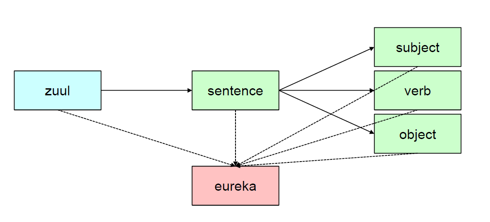

# Progetto ASW 2018
 

Progetto per il corso di Architettura dei Sistemi Software (a.a. 2017/2018)

## Indice dei contenuti

- [Caratteristiche generali](#caratteristiche-generali)
- [Applicazione](#applicazione)
- [Step deployment pipeline](#step-deployment-pipeline)
- [Team](#team)
- [Fonti](#fonti)
- [License](#license)

## Caratteristiche generali

In questa repository è presente un progetto di *continous delivery*. In particolare l'obiettivo principale è stato quello di sviluppare una semplice applicazione contenitorizzata in [Java](http://www.oracle.com/technetwork/java/javase/overview/index.html) e definire una pipeline con vari step per il rilascio su cloud dell'applicazione. 
Le principali tecnologie utilizzate nel progetto sono:
* [Gradle](https://gradle.org/) per l'assemblaggio e testing dell'applicazione
* [Docker](https://www.docker.com/) per costruire delle immagini, ognuna rappresentante un certo servizio dell'applicazione
* [Travis](https://travis-ci.org/), un servizio su cloud che permette di definire ed eseguire delle pipeline 
* [Amazon AWS](https://aws.amazon.com/it/) per ottenere una istanza del servizio EC2 su cui rilasciare l'applicazione

## Applicazione

L'applicazione consiste in un generatore di frasi casuali. Essa consta di più servizi distribuiti:

* Sentence, il servizio principale, applicazione [Spring Boot](https://spring.io/projects/spring-boot/) che crea frasi sempre diverse.
* Subject, che crea il soggetto.
* Verb, che crea il verbo.
* Object, che crea il complemento oggetto.

Tutti i servizi sono in esecuzione sulla porta 8080, ma in percorsi differenti.

Sentence sfrutta i 3 servizi di Subject, Verb e Object (i quali creano parole di tipo diverso) al fine di generare una frase di senso compiuto. Per semplicità, essi vengono trattati come profili di un servizio Spring Boot più generico, ovvero Word. In pratica, il soggetto, il verbo ed il complemento oggetto generati saranno istanze di oggetti Word, i quali verranno sfruttati da Sentence tramite REST nella formazione della frase finale.

Inoltre, abbiamo 2 ulteriori servizi:
* [Eureka](https://github.com/Netflix/eureka/), un servizio di Discovery.
* [Zuul](https://github.com/Netflix/zuul/), un servizio di gateway.

Di seguito, uno schema concettuale dell'applicazione:

Ad ogni servizio corrisponde un'immagine docker. In particolare ,essendo il servizio Word composte da tre sottoservizi,a runtime avremo 6 contenitori Docker in esecuzione. La comunicazione tra contenitori è attuata tramite **Docker Compose**, che come sappiamo permette di eseguire e definire applicazioni Docker basate su più contenitori. 

Docker Compose è basato sull’utilizzo di un file di configurazione **docker-compose.yml** per specificare i diversi servizi che compongono un’applicazione. Dopo di che, è possibile avviare l'applicazione eseguendo semplici comandi:
* **docker-compose build**, per costruire le immagini per i contenitori dell’applicazione. 
* **docker-compose up**, per avviare l’applicazione (creando e avviando i suoi contenitori).

Per arrestare l'applicazione, si esegue il comando **docker-compose down**.

Sono stati definiti tre tipi di test per verificare il corretto funzionamento dell'applicazione:

* JUnit tests, eseguiti in locale, per testare singolarmente le componenti dell'applicazione, in particolare Word e Sentence.
* Integration tests, eseguiti in fase di build, in cui ogni singolo servizio viene combinato e testato come gruppo.
* End-To-End tests, eseguiti in fase di deploy, per testare il corretto instaurarsi delle dipendenze tra i diversi servizi e per verificare che il flusso di informazioni sia pertinente e segua il percorso prefissato.

L'applicazione è raggiungibile tramite questo [link](http://ec2-18-216-21-241.us-east-2.compute.amazonaws.com:8080/)

## Step deployment pipeline

Come già accennato la pipeline è composta di vari step. Per sfruttare Travis è necessario semplicemente fare login sul sito web di Travis tramite il proprio account github e specificare su quali **repository** deve lavorare Travis. 

Le repository scelte devono contenere nella root un file **.travis.yml** che in un linguaggio proprietario di Travis specifica in maniera dichiarativa quali step devono essere eseguiti.

Travis offre la possibilità di eseguire degli script bash se gli step della pipeline sono particolarmente articolati. Per fare questo si usa nel .travis.yml la sintassi:

	script:
  	- bash <nome_script.sh>

In generale Travis definisce alcuni step predefiniti nella deployment pipeline, ognuno identificato da un nome simbolico (ad esempio fase di *install*, *before_install*, *deploy*). La sintassi generale è così definita:

	nome_fase: 
  		- azione 1
		- azione 2
        	.
		.
        	- azione n

La **pipeline** è così formata:
* alcune azioni preliminari, come la specifica del linguaggio di programmazione utilizzato, l'abilitazione di *sudo* e l'abilitazione di alcuni servizi aggiuntivi, nel nostro caso docker
* una fase **before_install** per decrittare la chiave per accedere alla macchina virtuale EC2
* una fase di **build** in cui viene eseguito lo script *build-and-runIntegrationTest.sh* che contiene dei comandi gradle per fare la build del codice ed eseguire solamente i test di integrazione. Infatti l'idea è che i test di unità vengano eseguiti in locale dagli sviluppatori
* l'esecuzione dello script *build-all-images.sh* che legge i **DockerFile** relativi ai quattro servizi dell'applicazione, costruisce le relative immagini e le carica su [DockerHub](https://hub.docker.com/)
* una fase di **deploy** in cui viene eseguito lo script *deploy.sh*. Questo script trasferisce a sua volta sulla istanza di EC2 alcuni script e il *docker.compose.yml* . Gli script scaricano le immagini relative all'applicazione da DockerHub, dalle 4 immagini istanziano 4 contenitori che poi sono fatti comunicare tramite docker-compose.
* l'esecuzione di test end-to-end per testare ulteriormente l'applicazione

Infine si può notare che nel *.travis.yml* sono state utilizzate delle variabili d'ambiente, ad esempio
*DOCKER_USERNAME*. Infatti Travis permette di definire, ad esempio nei setting della repository (metodo da noi adottato) delle variabili d'ambiente pubbliche oppure private (ad esempio un certo URL, o delle credenziali per accedere a dei servizi esterni)

## Team

- [Vincenzo Martello](https://github.com/vincenzomartello)
- [Jerin George Mathew](https://github.com/jgm25)
- [Nicholas Napolitano](https://github.com/nicholasnapolitano)
- [Marco Oliva](https://github.com/maroliva)
- [Simone Pellegrini](https://github.com/spellegrini1995)

## Fonti
	
Di seguito elenchiamo le varie fonti utilizzate per realizzare l'applicazione e scrivere la pipeline:
* [Spring Testing](https://docs.spring.io/spring/docs/current/spring-framework-reference/testing.html)
* [Baeldung](http://www.baeldung.com/)
* [Integration Test con Gradle](https://www.petrikainulainen.net/programming/gradle/getting-started-with-gradle-integration-testing-with-the-testsets-plugin/)
* [Travis-CI](https://docs.travis-ci.com/)
* [Docker](https://docs.docker.com/)
* [Docker Compose](https://docs.docker.com/compose/)

## License

This project is licensed under the MIT License - see the LICENSE file for details
